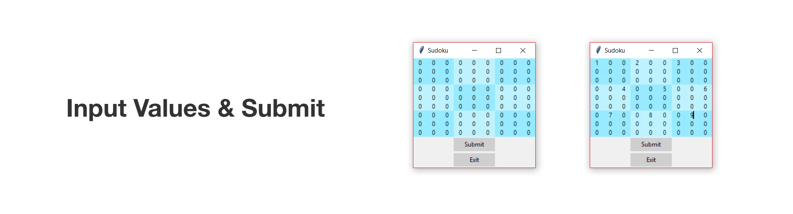
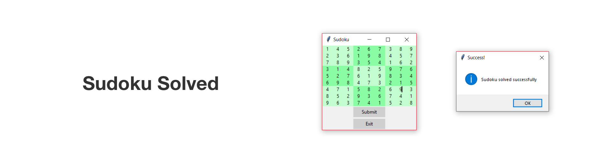

# Sudoku Solver

Employs a Back-tracking algorithm to solve the sudoku paired with a GUI made with 'tkinter'.

Just type in the value at the desired cell[s] and the program will attempt to solve it.

